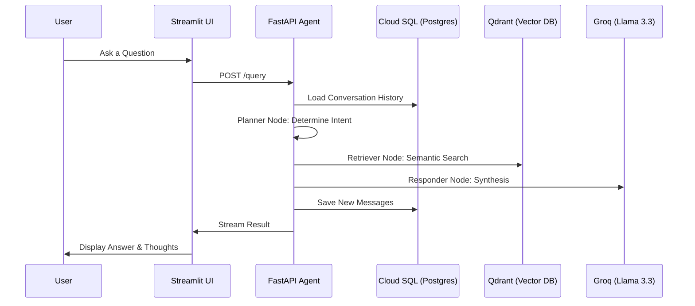

# 🏛️ System Architecture

The Enterprise Agentic RAG system is designed for **Scalability**, **Observability**, and **Intelligence**.

---

## 🗺️ Architectural Flow

---

## 🔑 Design Principles

### 1. Agentic Autonomy
The system doesn't just search; it **plans**. The Planner node decides if it needs to search the vector database or if it can answer from its internal memory.

### 2. High-Fidelity Retrieval
We use a **3-Tier Data Strategy**:
1.  **Raw**: Original documents (PDF/Docx).
2.  **Processed**: Cleaned, JSON-formatted chunks.
3.  **Vector**: High-dimensional embeddings stored in Qdrant.

### 3. Distributed Tracing
Every request is instrumented with **Logfire**, allowing us to trace a single user query from the UI through every internal LangGraph node to the final LLM call.

### 4. Zero-Touch Ingestion
By utilizing Cloud Storage triggers, we eliminate the need for manual indexing. The system is always "watching" for new knowledge.
