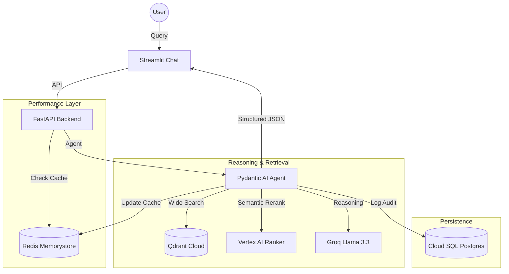

# 🤖 Enterprise Agentic RAG: Hybrid Multi-Cloud Edition

A high-performance, production-grade RAG (Retrieval-Augmented Generation) system leveraging the speed of **Groq**, the precision of **Google Vertex AI**, and the scalability of **Qdrant Cloud**.

---

## 🏗️ Architecture & Data Flow

This project uses a **Wide-Retrieve / Precise-Rerank** architecture to ensure both speed and accuracy.



---

## 🛠️ Tech Stack

*   **LLM (Reasoning)**: Groq (Llama 3.3 70B) for sub-second inference.
*   **Orchestration**: Pydantic AI (Agentic framework with self-correction).
*   **Vector Database**: Qdrant Cloud (Managed Vector Store).
*   **Ranking**: Vertex AI Ranking API (Semantic Re-ranker).
*   **Caching**: GCP Memorystore for Redis (Semantic Cache & Memory).
*   **Persistence**: GCP Cloud SQL for PostgreSQL (Audit & Logs).
*   **Frontend**: Streamlit (Native Chat UI).

---

## 📂 Project Structure

```text
├── app/
│   ├── services/
│   │   ├── qdrant_service.py   # Vector Search Logic
│   │   ├── ranking_service.py  # Vertex AI Re-ranking
│   │   ├── redis_service.py    # Semantic Caching & Memory
│   │   ├── database_service.py # Postgres Audit Logging
│   │   └── embedding.py        # Vertex AI Embeddings
│   ├── agent.py               # Pydantic AI Agent & Tools
│   ├── config.py              # Environment Mapping
│   └── main.py                # FastAPI Application
├── ui/
│   └── app.py                 # Streamlit Chat Interface
├── DOCS/                      # Deep-dive Technical Documentation
├── requirements.txt           # Python Dependencies
├── .env                       # Environment Secrets
└── Dockerfile                 # Cloud Run Configuration
```

---

## 🚀 Quick Start

### 1. Local Setup
1. **Clone & Install**:
   ```bash
   pip install -r requirements.txt
   ```
2. **Configure `.env`**: Add your Groq, Qdrant, and GCP credentials.
3. **Run API**:
   ```bash
   python -m uvicorn app.main:app --reload
   ```
4. **Run UI**:
   ```bash
   streamlit run ui/app.py
   ```

### 2. Cloud Run Deployment (Backend API)
```bash
gcloud run deploy rag-api \
  --source . \
  --region us-central1 \
  --timeout=300 \
  --allow-unauthenticated \
  --set-env-vars "GROQ_API_KEY=xxx,QDRANT_API_KEY=xxx,..."
```

---

## 🛡️ Enterprise Features

- **Semantic Caching**: Instant responses for repeat queries using Redis.
- **Chain of Thought**: Agent explains its reasoning in the `reasoning` field before answering.
- **Audit Trails**: Every interaction (query, thought, answer, sources) is saved to Postgres.
- **Auto-Correction**: Agent automatically retries (up to 5 times) if the model gives poorly formatted output.

---

## 📄 Documentation
For detailed guides on each component, see the [DOCS](file:///c:/Users/djadh/Downloads/rag_scale_test/rag-scale-test/DOCS) folder.
