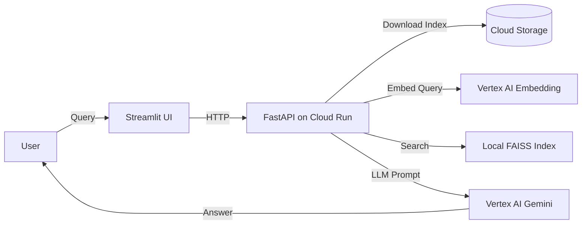

# Project Current State: Scalable RAG on GCP

## Overview
We have successfully transitioned the project from a localized prototype to a primary cloud-enabled RAG system on Google Cloud Platform (GCP).

## What is Currently Implemented?
1.  **Storage Layer**: 
    - Google Cloud Storage (GCS) is used as the backbone for document chunks, FAISS indices, and metadata.
    - Path structure: `vector_store/index.faiss` and `vector_store/metadata.pkl`.
2.  **Indexing & Search**:
    - **Cloud Persistence**: The FAISS index is built once and persisted to GCS.
    - **Optimization**: Batch size for embeddings is tuned to 50 to respect Vertex AI token limits.
3.  **Compute & API**:
    - **FastAPI Backend**: Deployed (or ready for deployment) on Google Cloud Run.
    - **Vertex AI Integration**: Using `text-embedding-004` and `gemini-1.5-flash` for high-performance RAG.
4.  **Frontend**:
    - **Streamlit UI**: Configured to connect to the deployed API via URL.

## Current Workflow Diagram

## What's Missing (Next Steps)
- **Advanced Vector DB**: Moving from FAISS (flat files) to **Qdrant** (managed service) for real-time updates and better scale.
- **Graph Database**: Adding **Neo4j** for entity-relationship mapping and knowledge graphs.
- **API Security**: Implementing Authentication (Identity Platform) and API Gateway.
- **Observability**: Centralized logging, tracing, and monitoring.
- **CI/CD**: Terraform-based infrastructure deployment.
