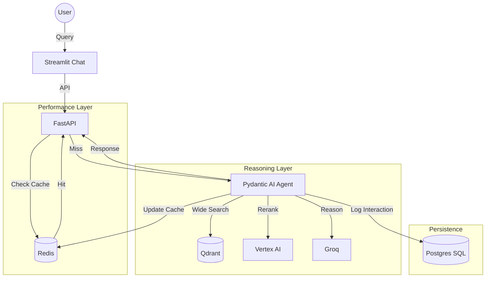

# Project Current State: Enterprise Agentic RAG (Hybrid Cloud)

## 🏗️ Architecture Overview
The system is a **Hybrid Multi-Cloud** RAG pipeline optimized for speed (Groq), scale (GCP), and reliability (Postgres/Redis).

### Core Stack
| Component | Technology | Role |
| :--- | :--- | :--- |
| **Reasoning Engine** | **Groq (Llama 3.3)** | Ultra-fast inference and tool orchestration. |
| **Orchestrator** | **Pydantic AI** | Agentic framework with reasoning and self-correction. |
| **Vector Store** | **Qdrant Cloud** | Managed vector database for wide retrieval. |
| **Re-ranker** | **Vertex AI Ranking API** | High-precision semantic filtering. |
| **Semantic Cache** | **Redis (Memorystore)** | Instant responses for repeat queries. |
| **Audit Log** | **Postgres (Cloud SQL)** | Permanent storage of every query/reasoning/answer. |
| **Frontend** | **Streamlit** | Native Chat UI with status tracking. |

## 🔄 The Enterprise Data Flow

## 🚀 Key Features
- **Semantic Caching**: Reduces LLM costs and latency to <100ms for repeat questions.
- **Audit Logging**: Every agent "thought" and source is stored for compliance and debugging.
- **Chain of Thought**: The agent reasons through the context before answering.
- **Graceful Fallbacks**: System remains operational even if Redis is unreachable (local dev).
