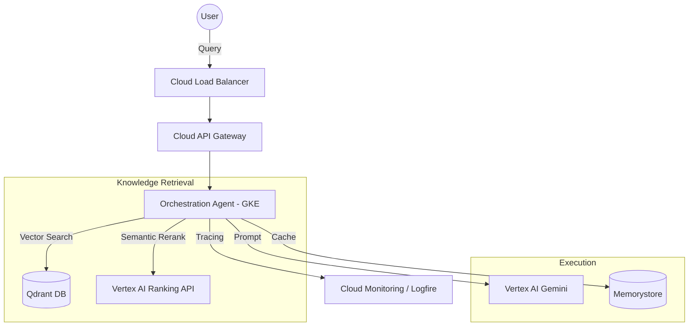

# AWS to GCP Stack Mapping Guide

Based on the goal architecture, here is how we translate the AWS components to their modern GCP equivalents.

## Architectural Comparison

| Layer | AWS (Original) | GCP (Replacement) | Why? |
| :--- | :--- | :--- | :--- |
| **Storage** | S3 | **Cloud Storage (GCS)** | Native blob storage with similar latency and cost. |
| **Compute** | EC2 / EKS | **GKE (Google Kubernetes Engine)** | Standardized orchestration for scalable microservices. |
| **Serverless** | Lambda | **Cloud Run** | Better for containerized APIs (FastAPI) than pure Lambda. |
| **Vector DB** | Qdrant (Self-hosted) | **Qdrant (GKE) or Vertex Vector Search** | Enterprise-grade vector similarity search. |
| **Graph DB** | Neo4j | **Neo4j Aura or GKE** | Industry standard for Knowledge Graphs. |
| **Cache** | Redis | **Cloud Memorystore** | Managed Redis with high availability. |
| **DB** | Aurora Postgres | **Cloud SQL (Postgres)** | Fully managed relational database. |
| **Model Serving** | Ray + vLLM | **GKE or Vertex AI Model Garden** | Scalable serving for large language models. |
| **Re-ranker** | N/A | **Vertex AI Ranking API** | Production-grade semantic re-ranking for higher precision. |
| **Monitoring** | Grafana | **Cloud Monitoring + Logfire** | Deep integration with GCP and Pydantic AI. |

## Target Architecture Diagram

