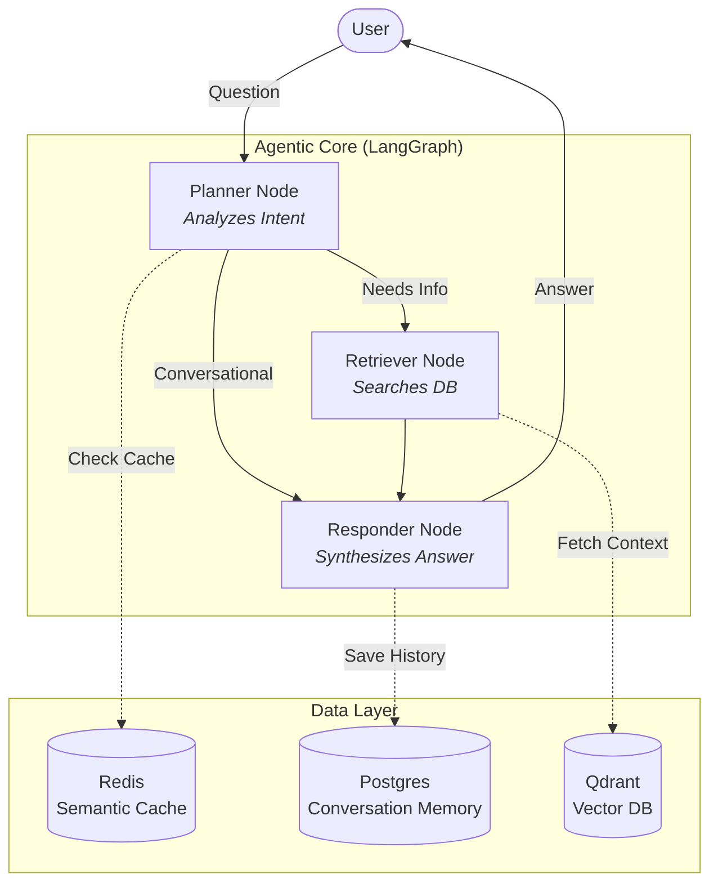
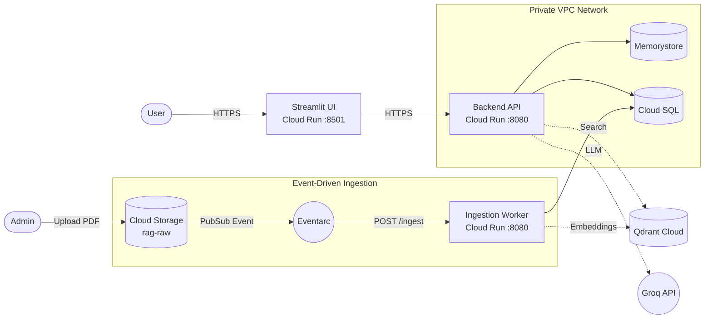

# 🤖 Enterprise Agentic RAG Platform

Welcome to the **Enterprise Agentic RAG Platform**. This repository contains a production-ready, highly scalable, and fully observable Retrieval-Augmented Generation (RAG) system. 

It has evolved from a simple local script into a robust **Event-Driven Microservices Architecture** deployed entirely on Google Cloud.

---

## 🏗️ Architecture Overview

The platform is designed using a decoupled microservices approach, allowing each component to scale independently based on demand.

### 1. The Local / Conceptual Flow
At its core, the RAG system operates on an Agentic framework using LangGraph.



### 2. The Cloud Infrastructure Flow (GCP)
In production, the application is split into specialized workers and connected via secure Google Cloud networking.



---

## 📚 Documentation Directory

We have thoroughly documented the system. Please explore the `DOCS/` folder for in-depth guides:

* **[The Development Journey](DOCS/01_Overview/01_Development_Journey.md)** - How we built this.
* **[Terminologies](DOCS/01_Overview/02_Terminologies.md)** - Jargon explained in simple words.
* **[Code Structure](DOCS/01_Overview/03_Code_Structure.md)** - Complete map of the codebase.
* **[Error History & Debugging](DOCS/04_Operations/01_Error_History_And_Debugging.md)** - The "Battle Scars" and how we fixed every deployment bug.
*(More architecture and Terraform guides available in the DOCS folder).*

---

## 🚀 Quick Start (Cloud Deployment)

Everything is managed via Infrastructure as Code (Terraform) and CI/CD (Google Cloud Build).

1. **Build the Microservices:**
   ```bash
   gcloud builds submit --config cloudbuild.yaml .
   ```

2. **Deploy the Infrastructure:**
   ```bash
   cd terraform
   terraform init
   terraform apply -auto-approve
   ```

3. **Ingest Data Automatically:**
   Simply upload a PDF or TXT file to your `[project_id]-rag-raw` Cloud Storage bucket. Eventarc will instantly wake up the ingestion worker and process the file into your Vector Database!

---
*Built with LangGraph, FastAPI, Streamlit, and Terraform.*
