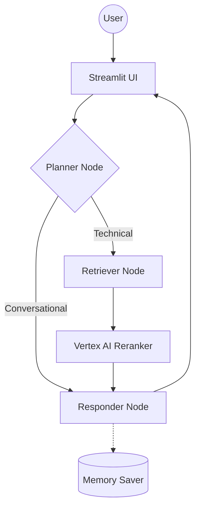

# 🤖 Enterprise Agentic RAG (Scalable Pipeline)

A production-grade, cyclic RAG system built with **LangGraph**, **GCP**, and **Groq**. This system distinguishes between technical "True Data" and random "Noisy Data" using semantic re-ranking and history-aware planning.

## 🔄 Agent Intelligence Flow


## 📂 Project Structure
```text
├── app/
│   ├── agents/          # LangGraph Nodes & State Logic
│   ├── pipelines/       # 3-Tier Ingestion Engine
│   ├── services/        # GCP, Qdrant, and Groq Clients
├── ui/                  # Premium Streamlit Chat Interface
├── DOCS/                # Standardized Documentation Folders
│   ├── 01_Architecture/ # System Design
│   ├── 02_Data_Pipeline/# Ingestion & Storage
│   ├── 03_Agentic_Brain/# AI Logic & State
│   ├── 04_Ops_Monitoring/# Logging & GCP
│   └── 05_Future_Roadmap/# Production Upgrade Notes
├── utils/               # Common Helper Utilities
└── requirements.txt     # Dependency Management
```

## 📚 Documentation Index

### 🏗️ 01. Architecture
- [System Overview](DOCS/01_Architecture/01_SYSTEM_OVERVIEW.md)

### 📥 02. Data Management
- [Ingestion Engine](DOCS/02_Data_Pipeline/02_INGESTION_ENGINE.md)

### 🤖 03. Intelligence & Logic
- [Node Intelligence](DOCS/03_Agentic_Brain/03_NODE_INTELLIGENCE.md)

### 🕵️ 04. Operations & Monitoring
- [Tracing & Backend Triggers](DOCS/04_Ops_Monitoring/04_TRACING_AND_GCP.md)
- [GCP Production Setup](DOCS/04_Ops_Monitoring/02_GCP_PROD_SETUP.md)
- [Deployment Strategy](DOCS/04_Ops_Monitoring/03_DEPLOYMENT_STRATEGY.md)

### 🚀 05. Future Roadmap
- [Redis Caching Upgrade](DOCS/05_Future_Roadmap/01_REDIS_CACHING.md)
- [Postgres Audit Memory](DOCS/05_Future_Roadmap/02_POSTGRES_AUDIT.md)

## 🚀 Quick Start (Local)

### 1. Ingest Data (True & Noisy)
```bash
python -m app.pipelines.ingestion.processor "DATA/true_data" "true" --wipe
python -m app.pipelines.ingestion.processor "DATA/noisy_data" "noisy"
```

### 2. Launch Backend
```bash
python -m uvicorn app.main:app --reload
```

### 3. Launch UI
```bash
streamlit run ui/app.py
```

---
*Built with ❤️ for Scalable AI Engineering.*
