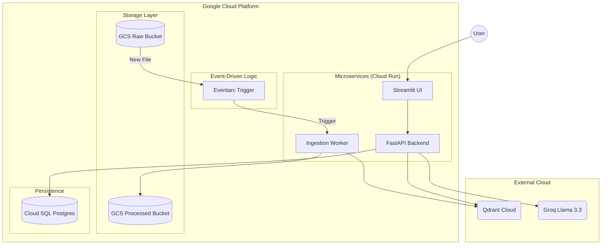

# 🚀 Enterprise Agentic RAG: Microservices Edition

An enterprise-grade, event-driven RAG system built on **Google Cloud Platform (GCP)**. This system leverages **LangGraph** for reasoning, **Postgres** for persistent agent memory, and **Eventarc** for automated data ingestion.

---

## 🏛️ System Architecture

This project has evolved from a local prototype into a decoupled, scalable microservices architecture.



---

## 🏗️ Core Components

1.  **Conversational UI**: A premium Streamlit interface for human-agent interaction.
2.  **Agentic Brain**: A FastAPI-based LangGraph engine that plans, retrieves, and synthesizes.
3.  **Persistence Layer**: Managed Cloud SQL (Postgres) ensuring the agent never forgets a conversation.
4.  **Auto-Ingestion Pipeline**: An event-driven worker that automatically "learns" from new files uploaded to GCS.
5.  **Infrastructure as Code**: The entire environment is managed and provisioned via **Terraform**.

---

## 📂 Project Documentation

Detailed guides for every layer of the system:

*   [**Microservices Architecture**](DOCS/MICROSERVICES.md) - Deep dive into the 3-tier split.
*   [**Cloud Infrastructure**](DOCS/CLOUD_INFRA.md) - How Terraform and Eventarc power the system.
*   [**Agent Reasoning**](DOCS/AGENTS.md) - The LangGraph logic and decision nodes.
*   [**Data Strategy**](DOCS/DATA_STRATEGY.md) - Raw, Processed, and Vector storage layers.
*   [**GCP Operations**](DOCS/GCP_OPS.md) - Deployment, Logging, and Monitoring.

---

## 🛠️ Quick Start

### 1. Build the Images
```bash
gcloud builds submit --config cloudbuild.yaml .
```

### 2. Provision Infrastructure
```bash
cd terraform
terraform init
terraform apply
```

---

*Built with ❤️ for High-Scale Enterprise RAG.*
